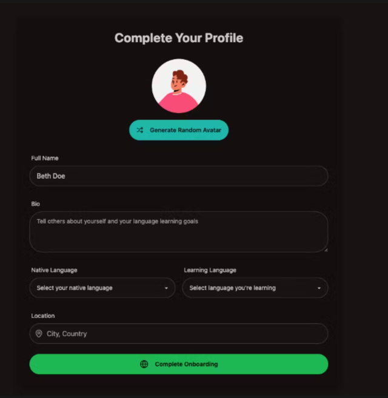

# Streamify

Live demo: https://streamify-bmad.onrender.com/


<br>
<p>
Streamify is a MERN‑stack language‑exchange web application that helps learners discover, connect, and practice with language partners. Sign up and complete a short onboarding profile, browse recommended matches, send and manage friend requests, chat in real time via Stream Chat, and create shareable video‑call links for practice sessions.</p>

## Table of contents 📌
- [About](#about)
    - [Summary](#summary)
    - [Key Features](#key-features)
   - [Tech Stack](#tech-stack)
- [Design](#design)
    - [Themes](#themes)
    - [Fonts and UI](#fonts-and-ui)
    - [Responsive view](#responsive-view)
- [Flowchart](#flowchart)
- [User Stories](#user-stories)
- [Screenshots](#screenshots)
    - [Desktop](#desktop)
    - [Mobile](#mobile)
- [Deployment](#deployment)
    - [.env Setup](#dotenv-setup)
    - [Run the Backend](#run-the-backend)
    - [Run the Frontend](#run-the-frontend)
- [Contact](#contact)


## About 

### Summary
 React app (Vite) built on the MERN stack with a production-ready backend. Frontend focuses: discover language partners, friend-request flow, real-time chat (Stream Chat), theming, and responsive UI.

### Key features
- Email/password auth + onboarding
- Discover recommended partners and send friend requests
- Notifications: accept / decline friend requests
- Real-time chat powered by Stream Chat and sendable video-call links
- Theme selector (Zustand) and responsive layout (Tailwind + DaisyUI)

### Tech Stack

  


 

 


- Frontend: React (Vite) 
- Styling: TailwindCSS (+ DaisyUI) 
- Backend: Node.js, Express
- Database: MongoDB (Mongoose / Atlas)
- Networking: Axios
- Realtime chat/calls: Stream (Chat + Video SDK)


## Design

#### Themes
- Multiple theme presets selectable via the ThemeSelector.
- Active theme persisted in localStorage (`streamify-theme`) via Zustand store.
- Theme drives global background and component accents (applied to body/main container).

#### Fonts and UI
- Tailwind + DaisyUI components for a clean, responsive UI.
- Consistent component spacing, rounded cards, and accessible controls.

#### Responsive view
- Layout uses a sidebar + main column pattern.
- Pages adapt to mobile using stacked layout and collapsible nav.
- Home discovery grid collapses to a single column on narrow viewports.

---

## Flowchart


This diagram illustrates the auth flow and protected-route logic used by the backend:
- Signup / Login: client calls /api/auth/signup or /api/auth/login, server creates/verifies user and generates a JWT.
- Token delivery: server sends the JWT back to the client in an HTTP-only cookie.
- Protected routes: subsequent client requests include the cookie; the auth middleware validates the JWT and either grants access or returns an error.
- Notes: Stream token generation and friend-request flows are separate operations (handled by server controllers) and can be annotated in the diagram if desired.

---

## User stories

| As a... | I want... | So that... |
|---|---|---|
| New user | I can sign up and complete onboarding | My profile (languages, location, avatar) is set and recommended partners show correctly |
| Logged-in user | I can browse recommended partners on Home | I can find good language exchange matches |
| Logged-in user | I can send a friend request | I can connect and start chatting with a partner |
| Recipient | I can accept or decline friend requests in Notifications | I can manage my connections |
| Connected users | I can open a chat and send messages / call links | We can coordinate practice sessions (video calls) |
| Any user | I can switch themes | The UI matches my preferred visual style and persists across sessions |
| Developer | I can run the app locally and inspect the API | I can reproduce and test flows before deployment |


---

## Screenshots

### Desktop
- #### Home / Discovery 

  

- #### Signup / Onboarding  

    

- #### Notifications

  

- #### Chat / Video call

  
  

- #### Theme examples  

   

### Mobile
- #### Signup

  

- #### Homepage

  

- #### Notifications

  

---

## Deployment
### .env Setup 🧪

#### Backend (`/backend`)

```
PORT=5001
MONGO_URI=your_mongo_uri
STREAM_API_KEY=your_stream_api_key
STREAM_API_SECRET=your_stream_api_secret
JWT_SECRET_KEY=your_jwt_secret
NODE_ENV=development
```

#### Frontend (`/frontend`)

```
VITE_STREAM_API_KEY=your_stream_api_key
```

---

### Run the Backend 🔧

```bash
cd backend
npm install
npm run dev
```

### Run the Frontend 💻

```bash
cd frontend
npm install
npm run dev
```

---

## Contact

<div align="center">
Send me an email
<br><br>

[tnil1143@gmail.com](mailto:tnil1143@gmail.com)

or check my profiles

[![Github][Github]][Github-url] [![LinkedIn][LinkedIn]][Linkedin-url]
</div>

[LinkedIn]: https://img.shields.io/badge/-LinkedIn-black.svg?style=for-the-badge&logo=linkedin&colorB=555
[LinkedIn-url]: https://www.linkedin.com/in/tomasz-nilipiuk-b5b88a239/
[Github]: https://img.shields.io/badge/github-black.svg?style=for-the-badge&logo=github&colorB=333
[Github-url]: https://github.com/nil1143

